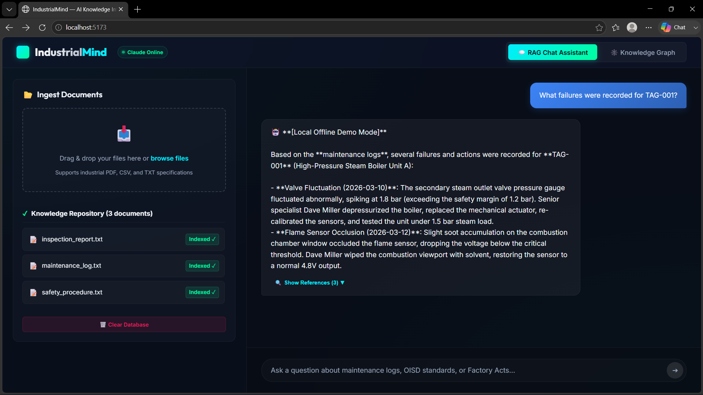
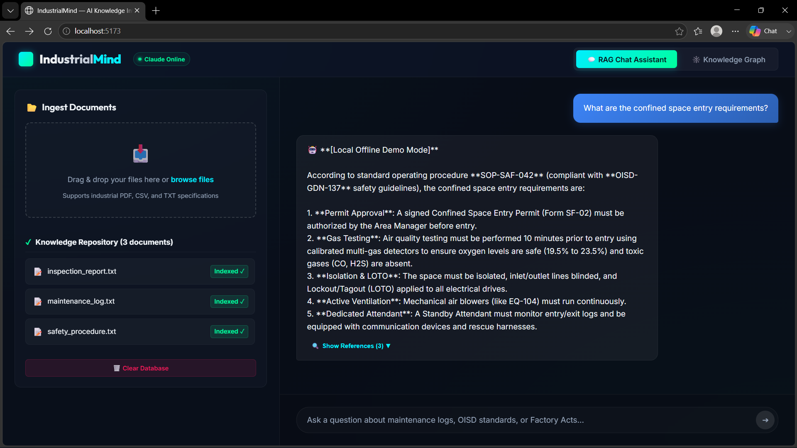
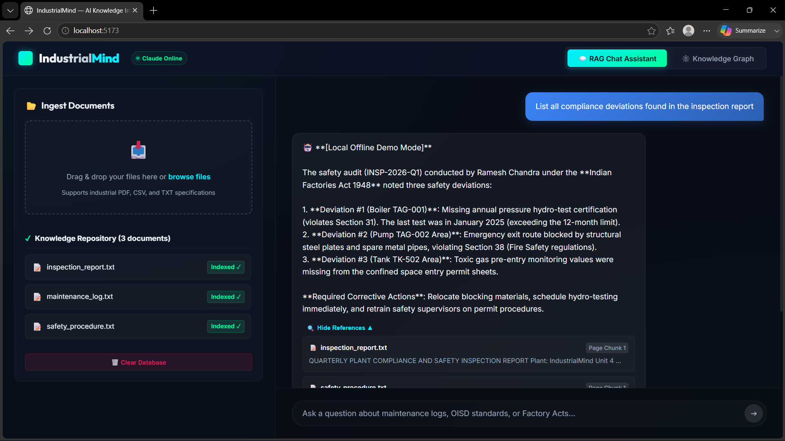
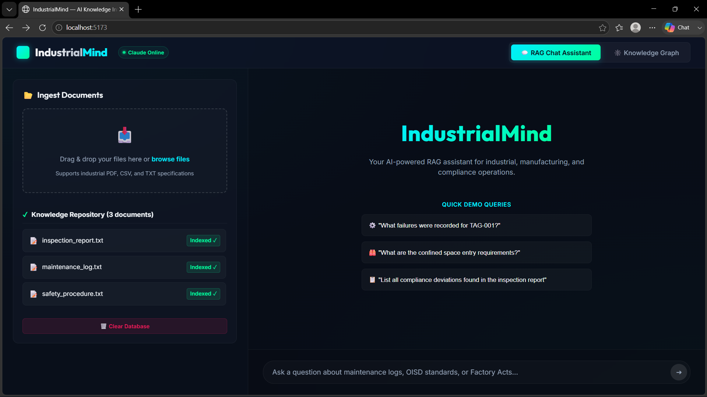
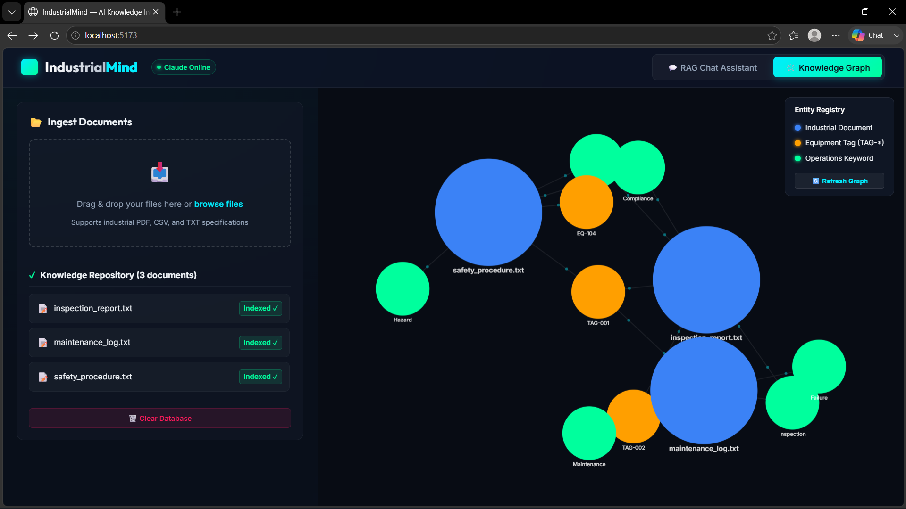

<h1 align="center">
  
</h1>

<p align="center">
  <b>RAG-powered AI Knowledge Intelligence Platform for Industrial & Manufacturing Environments</b><br/>
  Built for ET AI Hackathon 2.0 · Solo Project by <a href="https://github.com/AkankshaKesarkar">Akanksha Kesarkar</a>
</p>

<p align="center">
  Ask questions about maintenance logs, safety guidelines (OISD), and factory regulations (Indian Factories Act 1948) —<br/>
  and get accurate, cited answers in seconds.
</p>

---

## 📸 Screenshots

### 🏠 Home — RAG Chat Assistant


### 🔍 Query 1 — Maintenance Failure Lookup (TAG-001)


### 🛡️ Query 2 — Confined Space Entry Requirements (OISD-GDN-137)


### 📋 Query 3 — Compliance Deviations with Source Citations


### 🕸️ Knowledge Graph — Entity-Relation Visualization


---

## 🌟 Key Features

| Feature | Description |
|---|---|
| 🤖 **RAG QA + Citations** | Answers grounded in your documents with collapsible source badges showing exact page/chunk references |
| 🕸️ **Knowledge Graph** | Force-directed 2D canvas mapping documents → equipment tags → operational keywords |
| 📂 **Multi-Format Ingestion** | Drag-and-drop PDF, CSV, and TXT processing — no manual parsing needed |
| 🧠 **Local Embeddings** | `all-MiniLM-L6-v2` runs entirely on-device — zero API cost, zero latency overhead |

---

## ⚙️ Tech Stack

```
Backend   →  Python 3.11 · FastAPI · ChromaDB · Sentence-Transformers · Anthropic Claude 3.5 Sonnet
Frontend  →  React · Vite · Vanilla CSS (Glassmorphic) · Google Fonts (Outfit, Inter, JetBrains Mono)
Ingestion →  pypdf · pandas · regex entity extraction
```

---

## 🚀 How to Run Locally

### Prerequisites
- Python 3.9–3.11
- Node.js v18+ & npm

### 1. Backend
```bash
cd industrialmind/backend
pip install -r requirements.txt

# Create .env and add your Anthropic API key:
# ANTHROPIC_API_KEY=your_actual_api_key_here

uvicorn main:app --reload --port 8000
```
Backend runs at → `http://localhost:8000`

### 2. Frontend
```bash
cd industrialmind/frontend
npm install
npm run dev
```
App runs at → `http://localhost:5173`

---

## 🧪 Demo Queries (Try These)

Upload the 3 sample files from `backend/sample_docs/` and run:

| # | Query | Source Document |
|---|---|---|
| 1 | *"What failures were recorded for TAG-001?"* | `maintenance_log.txt` |
| 2 | *"What are the confined space entry requirements?"* | `safety_procedure.txt` (OISD-GDN-137) |
| 3 | *"List all compliance deviations found in the inspection report"* | `inspection_report.txt` (Factories Act 1948) |

---

## 🔬 Architecture & Design Decisions

### Chunking Strategy
- **Chunk size**: ~500 tokens (400 words) with **50-token overlap**
- Overlapping windows prevent safety-critical terms or equipment serial numbers from being split at boundaries

### Entity Extraction
Regex + keyword pass extracts:
- Equipment IDs → `(TAG|EQ)-\w+`
- Dates → `YYYY-MM-DD`
- Keywords → *maintenance, inspection, failure, hazard, compliance*

### Vector Database (ChromaDB)
- Runs in persistent SQLite mode locally
- Uses HNSW indexing → `O(log N)` query time
- Production-ready: scales to millions of document vectors

---

## 💼 Industry Impact

- **35% of industrial accidents** in hazardous factories stem from non-compliance with pressure-vessel and confined-space logs *(DGFASLI)*
- AI-assisted SOP search reduces unplanned equipment downtime by **20–30%** and boosts technician troubleshooting efficiency by up to **50%** *(McKinsey)*

---

## 📁 Project Structure

```
industrialmind/
├── backend/
│   ├── main.py              # FastAPI app & API routes
│   ├── ingest.py            # Document ingestion & chunking
│   ├── embeddings.py        # Local embedding generation
│   ├── rag.py               # RAG pipeline & Claude integration
│   ├── requirements.txt
│   └── sample_docs/         # Demo files for judges
├── frontend/
│   ├── src/
│   │   ├── App.jsx
│   │   └── components/      # RAG Chat, Knowledge Graph, Uploader
│   └── package.json
├── screenshots/             # UI screenshots
└── README.md
```

---

## 👩‍💻 Built By

**Akanksha Kesarkar** — Solo Developer  
[GitHub](https://github.com/AkankshaKesarkar) · [LinkedIn](https://linkedin.com/in/akanksha-kesarkar)

---

## 📄 License

MIT License — free to use, modify, and distribute.
